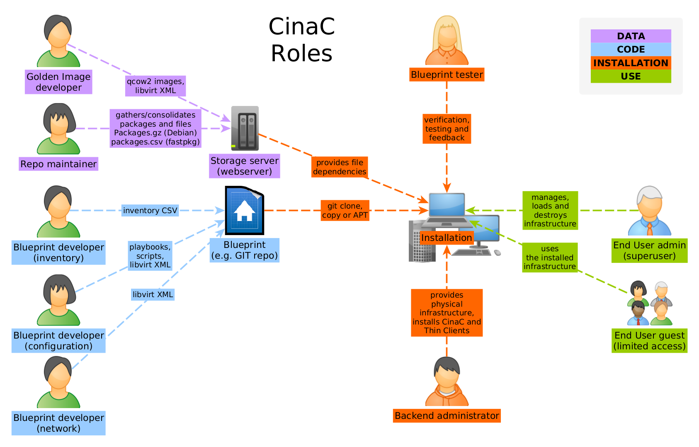

cinac(1) -- Generic infrastructure installation and management system
=============================================

[ACKNOWLEDGMENTS](#acknowledgments)

[DESCRIPTION](#description)

[FEATURES](#features)

[COMPARISON](#comparison)

[REQUIREMENTS](#requirements)

[INSTALLATION](#installation)

[BASIC USAGE](#basic-usage)

[UNDERSTANDING BLUEPRINTS](#understanding-blueprints)

[ROLES](#roles)

[DEVELOPING BLUEPRINTS](#developing-blueprints)

[SUPPORT](#support)

[KNOWN ISSUES](#known-issues)

[COPYRIGHT](#copyright)

[SEE ALSO](#see-also)

## ACKNOWLEDGMENTS

This project is in BETA. It is not intended for continues use in production.
Neither has this projects gone through a rigorous testing or security audit.

With that said it should be stable enough and safe to use in a lab or offline
environment. Use at your own risk and don't hold me responsible.

I continuously implement new features and change the code-base. So differences
in releases will probably break functionality. I will release a stable version
once I'm happy with the code-base, testing and have good documentation.

## DESCRIPTION

To make your life easier, here is a dictionary of terms used in this manual:  
[Servermonkeys IT-dictionary for dummies](https://github.com/ServerMonkey/servermonkeys-devtools/dictionary.md)

The goal of CinaC is to be a generic IT-infrastructure installation,
configuration and management system with focus on immutable hosts. It is mainly
build up on Debian, libvirt and Ansible. It takes ideas from Ansible Tower,
ESXi, OpenStack and DebianLAN. The basic concept is to use Infrastructure as
code in form of 'blueprints'. CinaC tries to follow these philosophies found
here:  
[ServerMonkey Software Philosophy](https://github.com/ServerMonkey/servermonkeys-devtools/software-philosophy.md)

CinaC is a recursive backronym that stands for 'CinaC is not a Cyberrange'.

It focuses on minimalism, modularity and documentation. It makes extensive use
of the shell for execution, simple CSV and INI style text files for
configuration, SSH for management and the Debian packagemangement system for
installation. CinaC actively avoids web applications, agents, databases,
microservices and a monolithic software architecture. CinaC is pretty strict on
how to do things. For example CinaC only uses libvirt, you can't choose between
libvirt or VirtualBox. The reason is simple: Less configuration overhead.
Having fewer choices is a feature here.

CinaC consists of several APT packages that are currently distributed via my
private server and can also be found on GitHub. CinaC bundled together with
Debian can also be considered a Derived Debian Distribution.

What you can do with it:

- Build IT-networks. Examples: Home lab, School network, Virtual training
  platforms for IT-security that can be build and destroyed on demand. You can
  build and manage networks that are entirely virtual, entirely physical or
  mixed.

- Remote kiosk applications. Examples: Thin clients that connect to remote
  virtual-host, like Storefront display monitors or a teacher-student
  IT-education platform.

## FEATURES

- In CinaC, the environment (IT-infrastructure) to install and configure is
  called a 'blueprint' and is defined only by code inside a single folder. All
  blueprint code is made of CSV, INI style configurations, Ansible Playbooks
  and libvirt XML files.

- All installation and configure of software (aka. deployment and provisioning)
  happens via SSH. This makes it possible to combine physical and virtual
  machines in the same environment. This also enables management of an existing
  infrastructure.

- Modular. CinaC is made of mostly CLI applications. Which makes it easy to
  build your own solution. For example: Only installing the APT package
  'cinac', creates a virtualization platform with management capabilities.
  First by installing the 'autokiosk' package it turns into a graphical kiosk
  application.

- Kiosk mode gives easy access to machines via a simple front-end and also
  allows you to integrate your own web applications.

- Virtual image deployment happens by using disk chains. Meaning that you can
  use a single Golden Image disk file and deploy it to multiple machines. Only
  new disk data will be written to a separate disk file. This increases
  deployment time. No need to copy disk images.

- Third party software and file sourcing/installation is provided via the
  fastpkg package manager. This includes Golden Images, custom software for
  Windows or any other kind of files from web-sources, like Wallpapers or zip
  files.

- Offline usage. Once a blueprint has been deployed, it can be destroyed and
  redeployed offline. No need for an internet connection.

- Some Golden Images and Demo blueprints are included. This includes playbooks,
  configurations and configuration scripts.

CinaC combines the following programs to realize its goals:

* [fastpkg](https://github.com/ServerMonkey/fastpkg) : file and software
  sourcing and installation
* [inventorymaker](https://github.com/ServerMonkey/inventorymaker) :
  SSOT inventory management
* [vmh](https://github.com/ServerMonkey/vmh) : VM deployment
* [wildwest](https://github.com/ServerMonkey/wildwest) : command and control
* [ansible-roles](https://github.com/ServerMonkey?tab=repositories&q=ansible-&type=source&language=&sort=name) :
  provisoning and configuration
* [autokiosk](https://github.com/ServerMonkey/autokiosk) : end user front-end
* [spice-web-client](https://github.com/ServerMonkey/spice-web-client) :
  Connect to VMs via web-browser

## COMPARISON

A comparison with other tools can be found
at: [github.com/ServerMonkey/cinac/docs/comparison.md](https://github.com/ServerMonkey/cinac/docs/comparison.md)
or in /usr/local/share/cinac/docs/comparison.md

## REQUIREMENTS

For first time users a single PC, Laptop or server is recommended.  
You can even try nested virtualization, but you need a full virtualization
capable hypervisor.  
Minimum hardware requirements for the Demo blueprints:

* CPU : single 2 GHz x86 CPU with 4 cores (8 cores for larger demo environments
  and faster deployment)
* RAM : DDR3 with 4-8 GiB min. (16 GiB if you want to test all demo
  environments)
* DISK : Single SSD with 200 GB of free space
* x86 virtualization : CPU should be capable of VT-x or AMD-V and the x64
  instruction set

All other hardware requirements are based on what blueprints you want to
develop and use.

For the OS, install a fresh copy
of [Debian 11 or 12](https://www.debian.org/download)  
Recommend following the Stable or Proposed release cykle.

## INSTALLATION

### Single instance

You can compile all code yourself, but I recommend using my public Debian 11
repo: [github.com/ServerMonkey](https://github.com/ServerMonkey/ServerMonkey)  
Add this repo first. Then install the basic headless server with:

    $ sudo apt install cinac

Or to install everything, including a full desktop environment, you can install
the meta package:

    $ sudo apt install cinac-full

This will install:

* cinac
* autokiosk
* spice-web-client
* nginx
* pulseaudio

Then run the following command and follow the graphical terminal
instructions. For a quick-start, first time users in a lab environment can just
push enter on all questions.

    $ cinac-init

To run 'cinac-init' unattended, export some or all of the following variables
before you run 'cinac-init':

    # These are the default settings (same as pressing enter on each question)
    export CINAC_PYARG=true  #false
    export CINAC_GPGAGENT=merge  #ignore,replace
    export CINAC_KEY=existing  #new,skip
    export CINAC_MAIL=cinac@localhost
    export CINAC_NAME=CinaC
    export CINAC_PASSWORD=none

### Firewall

cinac-init will also enable certain firewall rules.  
The rules allow SSHD, HTTP, HTTPS, SPICE-WS/WSS on all physical and WI-FI
interfaces but not on any virtual interfaces. This is to prevent accidental or
malicious access to the virtualization platform from within the virtual
network.

DNSMASQ is enabled on all interfaces. This is to allow DHCP and DNS resolution
for the virtual machines.

The allowed SPICE ports are 7200 to 7300 for unencrypted (WS) and 8200 to 8300
for encrypted (WSS) connections.

To see all firewall rules run:

    sudo ufw status numbered

Every time you run cinac-init the firewall rules will be reset. So if you want
to add your own rules, you need to add them each time after running cinac-init.

### SPICE web client

To connect to the virtual machines via a web-browser, you need to install the
spice-web-client and a webserver.

    $ apt install spice-web-client nginx

To enable encryption for SPICE over HTTPS+WSS, you need to create a
certificate for the CinaC host. You can create a simple self-signed certificate
but this will not work wil all browsers. For example Firefox requires a full
root-authority chain. Chromium based browser can just add a self-signed
certificate as exception.

Put your certificates in the folloing location:

Certificate: /etc/ssl/certs/cinac.crt  
Private-key: /etc/ssl/private/cinac.key

### Autokiosk

To enable the autokiosk front-end, you need to install the autokiosk package:

    $ sudo apt install autokiosk

After installation reboot and rerun 'cinac-init' to enable autokiosk.

To open a VM in autokiosk (virt-viewer), run:

    $ autokiosk <VM_NAME>

In virt-vier mode the VM will hog you entire keyboard and mouse. To exit
virt-viewer mode, press 'CTRL+ALT' once and then press another of the following
key combinations to leave virt-viewer mode:

'ALT+TAB' to switch between windows.  
'CTRL+SHIFT+F9' to minimize only all VM autokiosk windows.  
'CTRL+SHIFT+F10' to minimize all autokiosk windows.  
'CTRL+SHIFT+F12' to minimize all autokiosk windows and start 'cinac tgui'.

It is important that you press the correct key combination after 'CTRL+ALT'.
Else the virt-viewer assumes you want to send the key combination to the VM.  
This can be trycky if you push the keys too fast, slow or in the wrong order.  
Try it a couple of times to get the hang of it.

The next step requires the package spice-web-client and nginx.  
To open a VM in autokiosk over HTTP+WS, run:

    $ autokiosk http://<CINAC_HOST>/<VM_NAME>

The next step requires a fully working root certificate chain. A single
Self-signed certificate will not work with the package simple-kiosk.  
To open a VM in autokiosk over HTTPS+WSS, run:

    $ autokiosk https://<CINAC_HOST>/wss.<VM_NAME>

### Multiple hosts / cluster / server farm

If you have only a couple of hosts, you can install via an automated bootable
USB-stick. Follow this guide:  
[Ventoy with Debian Preseed and fastpkg](https://github.com/ServerMonkey/servermonkeys-devtools/docs/ventoy.md)

## BASIC USAGE

After installation and cinac-init you need to get some blueprints.  
Demo blueprints can be installed via:

    $ cinac install-demo-blueprints

List all available blueprints:

    $ cinac list-available

Load a blueprint:

    $ cinac-load <BLUEPRINT_NAME>

List currently running blueprint:

    $ cinac list-available

You are only allowed to load one bluprint at a time.  
To unload any blueprint:

    $ cinac unload

Or run the Terminal GUI for a graphical interface:

    $ cinac tgui

## UNDERSTANDING BLUEPRINTS

Once you have installed the demo blueprints, you can open the readme file in
~/.cinac/demo-tiny/README.md . If you haven't installed them yet, they can be
found in /usr/local/share/cinac/demo-blueprints/. The demo blueprints contain
additional documentation that you can explore further. First try to
understand 'demo-tiny' then 'demo-home' and last 'demo-company'. Each of the
demo blueprints will teach you a bit more.

## ROLES

If you work as a team, seven basic work roles can be associated with the
development and usage of CinaC. The roles can be assigned to different people
or be done by a single individual. This list exist to get a better
understanding of how CinaC works and what skills are required to use each part
of it.

**Backend administrator**

Builds and maintains the hardware and software required to run CinaC.

- Required skills:
    - Debian 11/12
    - APT
    - GPG
    - SSH
    - Server hardware
- Recommended literature and courses:
    - [Debian Administrator's Handbook](https://debian-handbook.info/browse/stable/)
    - [Debian Reference](https://www.debian.org/doc/manuals/debian-reference/)
    - [Debian Wiki](https://wiki.debian.org/)
    - [SSH Mastery (M. W. Lucas)](https://mwl.io/nonfiction/tools#ssh)
    - [udemy.com - Linux Administration: The Complete Linux Bootcamp for 2023](https://www.udemy.com/course/master-linux-administration/)

**Repo maintainer**

Maintains a list of software and files that will be used in blueprints

- Adds new software or files to the repository
- Required skills:
    - [Debian package system](https://www.debian.org/doc/manuals/debian-reference/ch02.en.html)
    - [How to build Debian packages](https://www.debian.org/doc/manuals/maint-guide/build.en.html)
    - [Set up a Debian repo server](https://wiki.debian.org/SettingUpSignedAptRepositoryWithReprepro)
    - basic understanding of sha256 hash
    - basic understanding of SSL/TLS
    - fastpkg
    - target OS specific knowledge (example: Windows or Ubuntu)
        - Silent installer command-line arguments
        - File and Executable file formats

**Golden Image developer**

Creates custom libvirt operating system images.

- Required skills:
    - [libvirt XML format](https://libvirt.org/format.html)
    - qcow2 format
    - virtio
    - Cygwin
    - SSH, SSHD
    - virsh
    - virt-manager
    - vmh
    - target OS specific knowledge

**Blueprint developer (inventory)**

Creates and maintains a list of hosts

- Required skills:
    - [libvirt XML format](https://libvirt.org/format.html)
    - target OS specific knowledge
    - target OS authentication structure of different OS:es, like: sudo, su or
      SYSTEM/Administrator roles on Windows
    - CSV format
    - LibreOffice Calc

**Blueprint developer (configuration)**

Writes scripts and playbooks that installs software and configures the target
hosts.

- Required skills:
    - [libvirt XML format](https://libvirt.org/format.html)
    - Ansible
    - [udemy.com: Dive Into Ansible - Beginner to Expert in Ansible](https://www.udemy.com/course/diveintoansible/)
    - Shellscript
    - Python
    - target OS specific knowledge

**Blueprint developer (network)**

Develops virtual networks (switches, routers, Ethernet).

- Required skills:
    - [libvirt XML format](https://libvirt.org/format.html)
    - extensive TCP/IP stack knowledge including:
    - DNS, DHCP, IPv4/v6, MAC addresses, VLAN...

**Blueprint Tester**

Test deploys blueprints and reports bugs to the blueprint developers. Checks
the blueprints for quality, compliance, correctness and basic security before
they are allowed to run in production.

- Required skills:
    - Same basic knowledge as all the Blueprint developers
    - Has 'meticulous' as a personality trait

## DEVELOPING BLUEPRINTS

### Workstation installation

Blueprint development is done on a CinaC workstation. The workstation can be
installed on a physical machine or in a virtual machine.

First you need to follow the 'Single instance' installation guide above. After
that install the development tools via:

    $ sudo apt install \
        servermonkeys-devtools \
        servermonkeys-templates \
        ansible-role-servermonkey-cinac \
        isoremixer \
        cinac2deb

If you are on a machine that already has a Desktop environment, you are done.
If not, you can automatically set up a complete development workstation by
running the following command. Be mindful this is only recommended on a fresh
Debian 11 installation.

    $ ww -t localhost servermonkey.cinac -b devstation

### Development flags

You can use the following flags to speed up the development process. This is
helpful when you are experimenting and changing parts of a blueprint and don't
want to reload the whole blueprint.

    $ cinac-load <BLUEPRINT_NAME> <FLAG>
    $ cinac load <FLAG>
    $ cinac load-fast <FLAG>

- `v` - Print more debug information, up to four levels, like: 'vvvv'
- `s` - Skip ha**s**h verification of fastpkg downloads, assumes they are
  correct
- `i` - Skip VM **i**nstallation step in [auto-config]
- `c` - Skip the **c**onfiguration step in [auto-config]

cinac 'load-fast' always includes the 's' flag.

### Tutorial

First you need to understand what the above tools do. Read up on them here:

[servermonkeys-devtools](https://github.com/ServerMonkey/servermonkeys-devtools)  
[servermonkeys-templates](https://github.com/ServerMonkey/servermonkeys-templates)  
[ansible-role-servermonkey-cinac](https://github.com/ServerMonkey/ansible-role-servermonkey-cinac)  
[isoremixer](https://github.com/ServerMonkey/isoremixer)  
[cinac2deb](https://github.com/ServerMonkey/cinac2deb)

To enable more Windows software in the fastpkg repo, please submit installation
arguments here:
[github.com/ServerMonkey/servermonkeys-templates/packages_args.txt](https://github.com/ServerMonkey/servermonkeys-templates/packages_args.txt)

## SUPPORT

I develop this project in my spare time. So please respect if I do not answer
immediately or ignore questions that seem stupid or unrelated to this project.
That being said you can get support via Discord, mail dev(at)muspekaren.se or
GitHub. I am usually available UTC+2 (Sweden) on mo-fr after 18:00 PM.
Preferably via mail or GitHub-issues.

## KNOWN ISSUES

- **fastpkg does not install / download a package** : Fastpkg downloads
  packages from all over the Internet. Sometimes servers are down or there are
  connection issues. Running fastpkg again or with '-f' usually fixes the
  issue. If not, the culprit is usually an outdated link. In that case please
  contact me, and I will fix it. To get around that problem yourself, you can
  mirror and host a local copy of any fastpkg repo yourself.
- **There is no sound from the VM in virt-viewer/autokiosk** : This seems to be
  a bug or a virt-viewer dependency issue. The workaround is to install the
  package 'pulseaudio' and reboot, on the machine you are running virt-viewer
  on (not the VM).

## COPYRIGHT

See license file

## SEE ALSO

fastpkg(1), inventorymaker(1), vmh(1), wildwest(1), autokiosk(1),
spice-web-client(1), cinac2deb(1), ansible2deb(1), isoremixer(1)

[github.com/ServerMonkey/cinac](https://github.com/ServerMonkey/cinac)  
[github.com/ServerMonkey/cinac/docs](https://github.com/ServerMonkey/cinac/docs)
